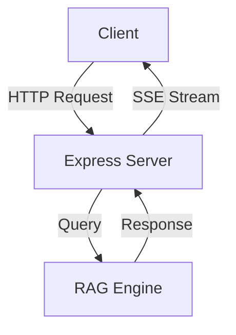
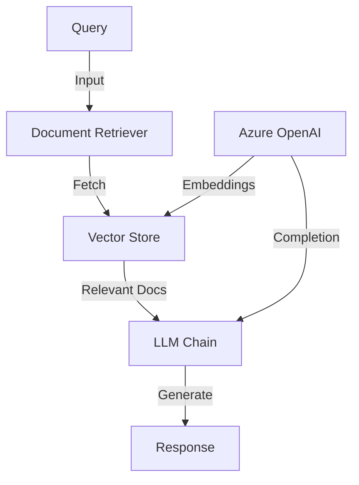
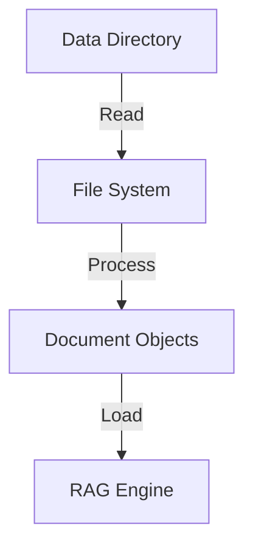

# Architecture Documentation

## System Overview

The GhostMe AI Assistant is built on a modern, scalable architecture that combines several key components to provide an intelligent portfolio assistant. The system uses RAG (Retrieval-Augmented Generation) technology to deliver accurate, context-aware responses.

## Core Components

### 1. Express Server (app.js)

- Handles HTTP requests and responses
- Implements SSE (Server-Sent Events) for streaming
- Manages CORS and request validation
- Routes requests to appropriate handlers

### 2. RAG Engine (ragEngine.js)

- Manages document processing and retrieval
- Handles vector embeddings and storage
- Coordinates with Azure OpenAI for generation
- Implements custom prompt templates

### 3. Content Loader (loader.js)

- Reads portfolio content from data files
- Creates structured document objects
- Manages file system interactions

## Data Flow

1. **Request Processing**
   - Client sends query to `/api/ask` endpoint
   - Express server validates request
   - Query forwarded to RAG engine

2. **Content Retrieval**
   - RAG engine searches vector store
   - Relevant documents retrieved
   - Context assembled for generation

3. **Response Generation**
   - LLM generates response with context
   - Response streamed to client
   - Optional TTS conversion

## Integration Points

### External Services

1. **Azure OpenAI**
   - Embeddings generation
   - Text completion
   - Text-to-speech conversion

2. **Pinecone**
   - Vector storage
   - Similarity search
   - Document retrieval

## Security Considerations

1. **API Security**
   - CORS configuration
   - Input validation
   - Error handling

2. **Environment Variables**
   - Secure credential storage
   - API key management
   - Service configuration

## Scalability

1. **Vector Store**
   - Concurrent operations
   - Query optimization
   - Index management

2. **Server**
   - Streaming response handling
   - Request queuing
   - Resource management

## Development Workflow

1. **Local Development**
   - Environment setup
   - Service configuration
   - Testing procedures

2. **Deployment**
   - Environment variables
   - Service dependencies
   - Monitoring setup